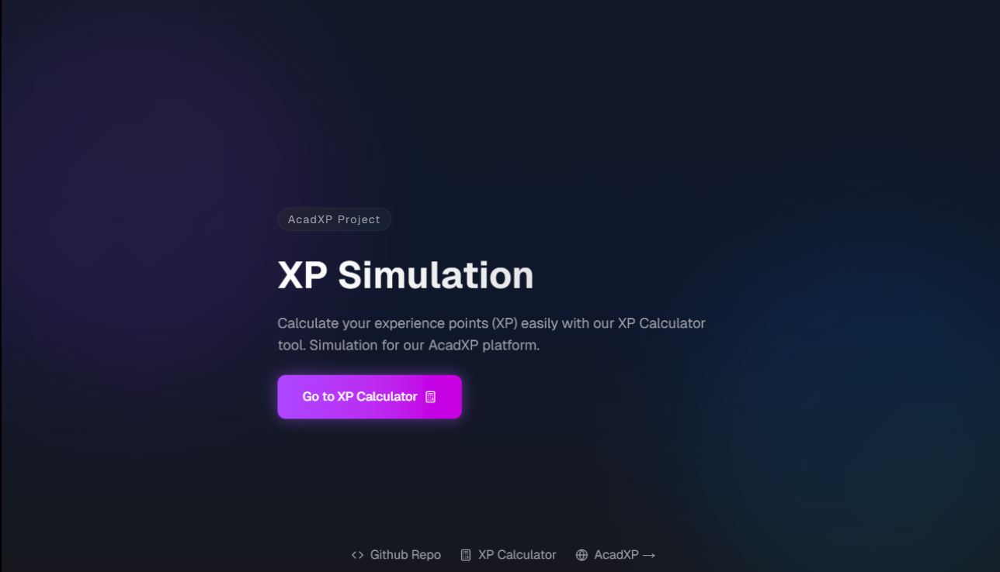
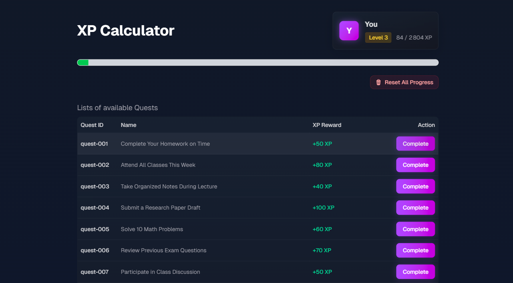

# XP-Cal

A demonstration simulator for the XP calculation system used in the AcadXP platform. This project showcases how experience points, levels, and quests are implemented in our gamified learning environment.

## Overview

XP-Cal simulates the core leveling and quest mechanics of AcadXP, demonstrating how students progress through their learning journey. The calculator helps visualize XP accumulation, level progression, and quest completion rewards.

## Screenshots

### Home Screen



### XP Calculator



## Features

- 🧮 Live XP calculation and level progression simulation
- 📊 Real-time progress tracking with visual feedback
- 🎯 Interactive quest system demonstration
- 📈 Level-up animations and notifications
- 🎨 AcadXP's UI components showcase
- ⚡ Built with Next.js 15 and React 19
- 📱 Responsive design matching AcadXP's interface

## Data Structure

### Player Interface

```typescript
interface Player {
  id: string;
  name: string;
  level: number;
  currentXP: number;
  totalXP: number;
}
```

### Quest Interface

```typescript
interface Quest {
  id: string;
  title: string;
  description: string;
  xpReward: number;
}
```

## Quest Examples

```typescript
export const QUESTS = [
  {
    id: "DAILY_LOGIN",
    title: "Daily Login",
    xpReward: 100,
  },
  {
    id: "COMPLETE_LESSON",
    title: "Complete a Lesson",
    xpReward: 500,
  },
  {
    id: "WEEKLY_PRACTICE",
    title: "Practice Champion",
    xpReward: 1000,
  },
];
```

## Getting Started

1. Clone the repository:

```bash
git clone https://github.com/acadxp/xp-cal.git
cd xp-cal
```

1. Install dependencies:

```bash
pnpm install
```

1. Run the development server:

```bash
pnpm dev
```

1. Open [http://localhost:3000](http://localhost:3000) in your browser.

## Components

- `ProgressBar`: Visualizes current XP and progress to next level
- `LevelUpToast`: Displays level-up animations and congratulations
- `QuestsTable`: Shows available and completed quests
- `PlusXP`: Animated XP gain indicator

## How It Works

The simulator demonstrates AcadXP's leveling formula:

- Base XP for level 1: 100
- Each level requires previous level's XP \* 1.5
- Quest completion adds XP immediately
- Level-ups are calculated automatically
- Progress is shown in real-time

## Contributing

This is a demonstration project for AcadXP's mechanics. For feature suggestions or bug reports create an issue. Thanks!

## License

This project is licensed under the MIT License - see the [LICENSE](LICENSE) file for details.
